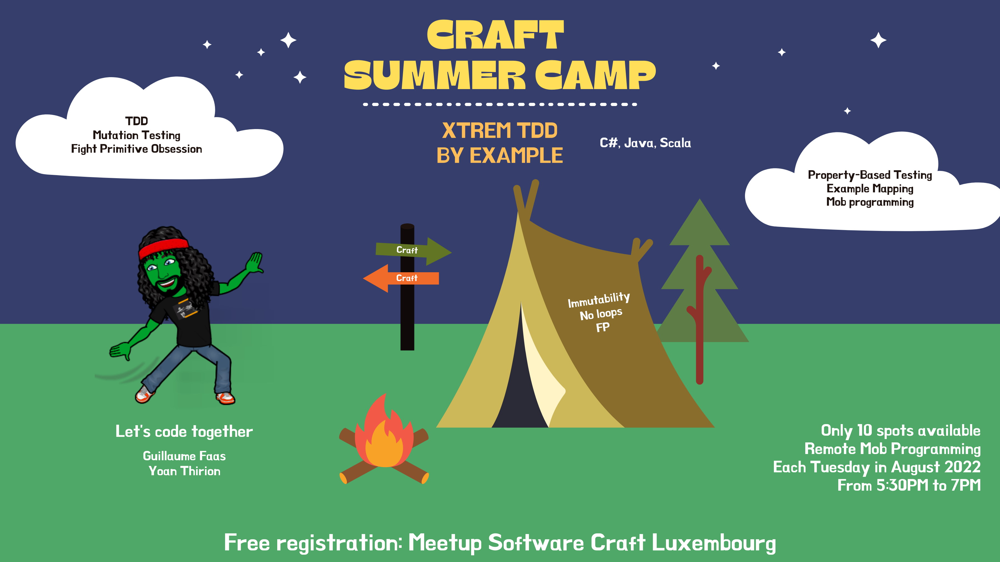
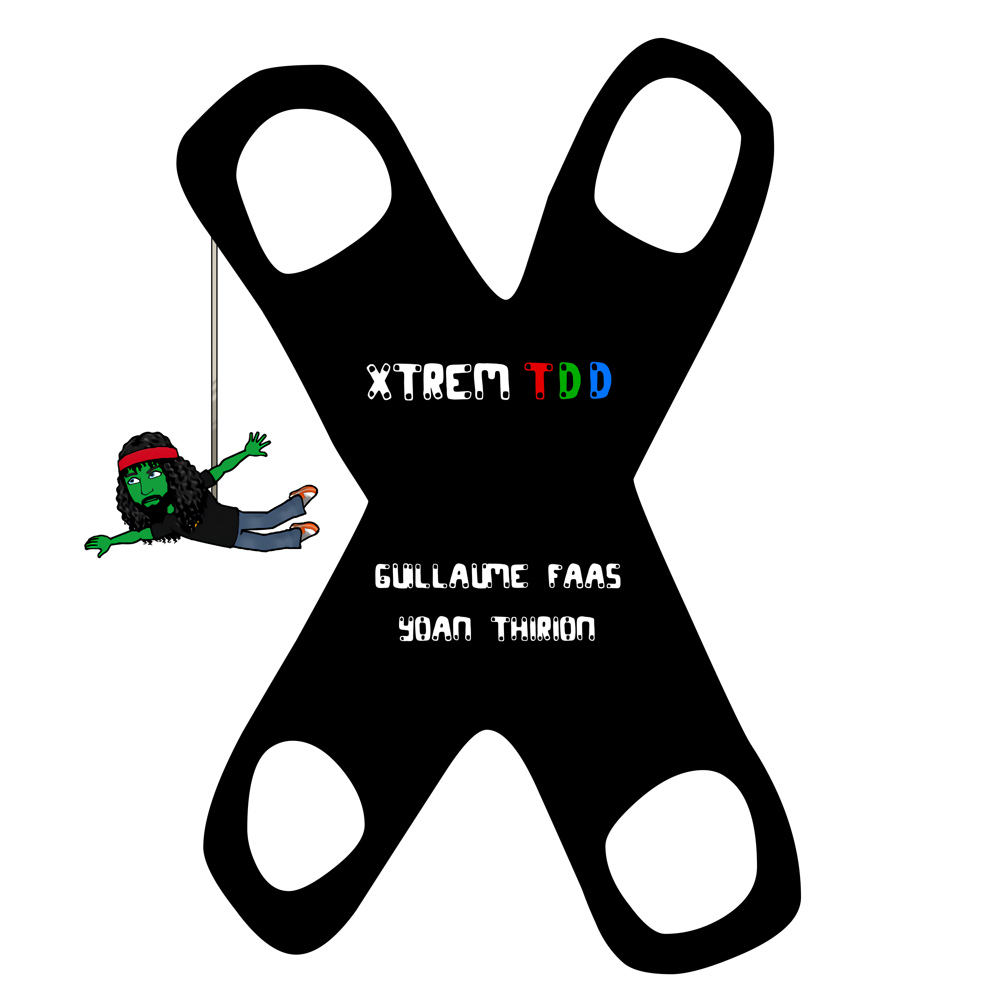

# Craft Summer Camp
This repository will be used in the [`Software Craft Luxembourg Community`](https://www.meetup.com/fr-FR/software-craft-luxembourg/) during our [Summer Camp](https://www.meetup.com/software-craft-luxembourg/events/287058331?utm_medium=referral&utm_campaign=share-btn_savedevents_share_modal&utm_source=link) in August 2022.

## Xtrem TDD By Example
You have probably already heard or practiced Test-Driven Development (TDD) but have you already tried it in an Xtrem way?
We propose to practice TDD on a kata using mob programming and introducing different topics on top of it:

- Mutation Testing
- Generate Code From Usage
- TDD on existing code
- Refactoring techniques
- No Primitive Types
- No For Loops
- Only Immutable Types
- No Exception
- Use an Existing Monad
- Property-Based Testing to challenge our Domain Model
- ...

> We expect attendees to learn about these topics and use them while applying TDD.

In those online sessions, we propose to:
- Present the website, the related concepts, and why we are building it - 10 min -> https://xtrem-tdd.netlify.app/
- Practice on a kata in mob programming in baby steps (mobs of 5 persons in the same language) - 1h15
- Q&A session - 5 min

The kata is available in 3 languages: `C#`, `Java` and `Scala`.

> There will be 1 mob session per week during the whole August (2022) month.

### Prerequisites
- A computer
- Your favorite IDE for coding in C#, java or scala (Rider, Visual Studio, IntelliJ, ...)
- Clone [this repository](https://github.com/les-tontons-crafters/xtrem-tdd-scl)
- Make sure you can run the tests by opening the folder corresponding to your favorite language

> Everybody in the mob will drive at a point in time so be ready to share your screen too

#### Workshop structure
We have structured this workshop using the [4C model](https://www.bowperson.com/2017/11/reposting-a-quick-guide-to-the-4cs-map/) :

- `Connection` : Help learners make connections with the topic of the workshop
- `Concepts` : Direct instruction, lecture or presentation part
- `Concrete Practice` : Learners actively practice a new skill using the new information
- `Conclusion` :  Learners summarize what they have learned

## Workshop
- [Connection](docs/connection.md)
- [Concepts](docs/concepts.md)
- [Concrete Practice](docs/concrete-practice.md)
- [Conclusion](docs/conclusion.md)

## Camp Photo

<table>
<tr>
    <td align="center" style="word-wrap: break-word; width: 150.0; height: 150.0">
        <a href=https://github.com/ythirion>
            
             
            <b>Yoan Thirion</b>
        </a>
    </td>
</tr>
</table>

